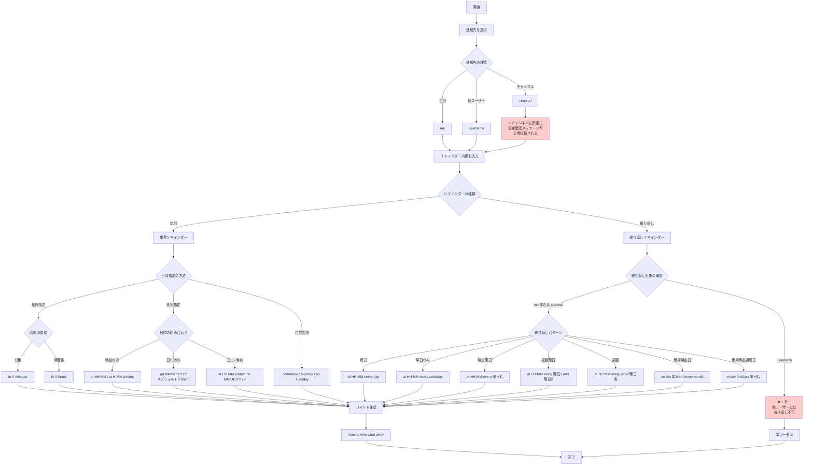
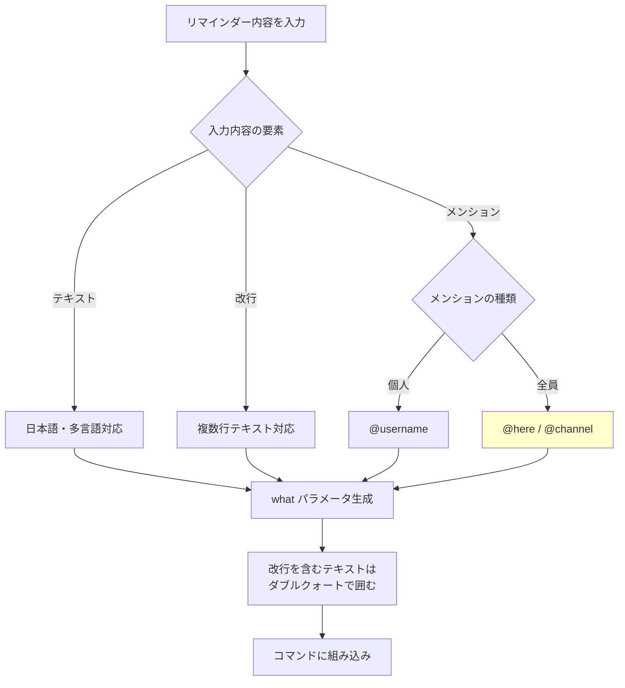
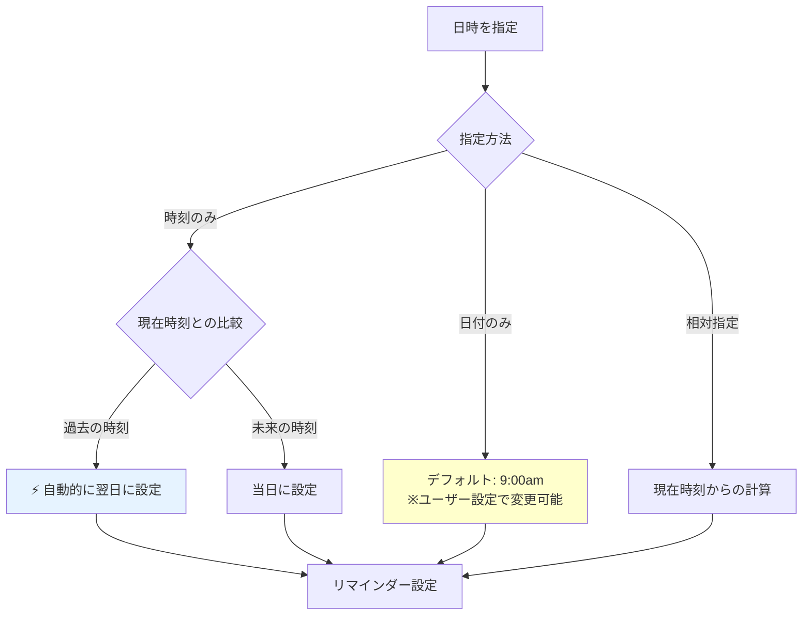
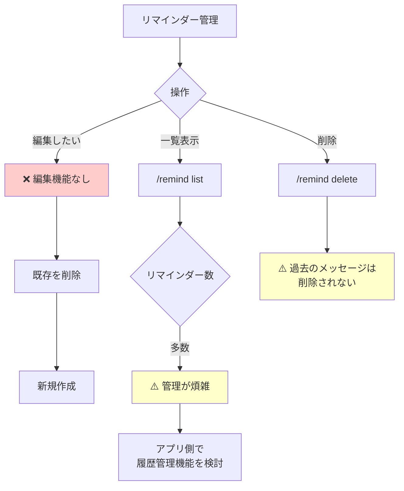
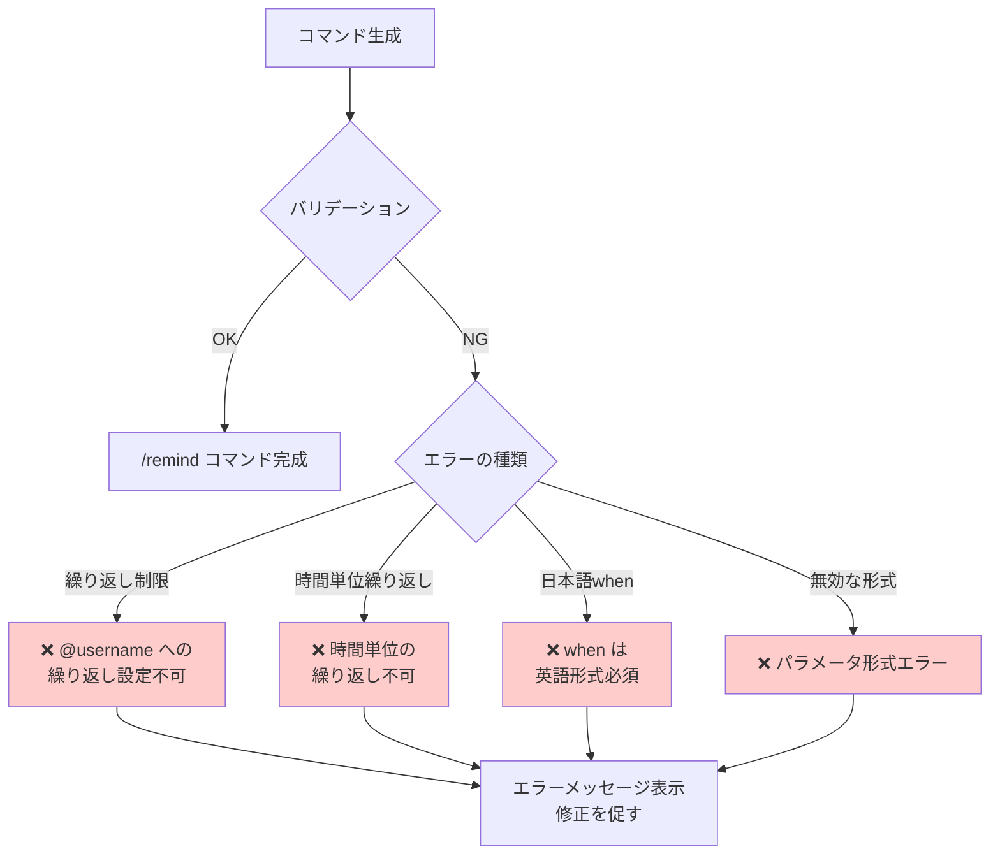

# Slackリマインダーコマンド フローチャート

このドキュメントは、[COMMAND_SPEC.md](./doc/COMMAND_SPEC.md)に基づいて、Slackリマインダーコマンド生成アプリの処理フローをMermaidフローチャート形式で整理したものです。

## メインフローチャート

## メッセージ内容の詳細フローチャート

## 時刻指定の詳細ロジック

## 制約事項と管理フロー

## エラーハンドリングフロー

